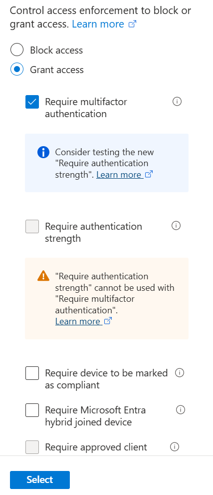
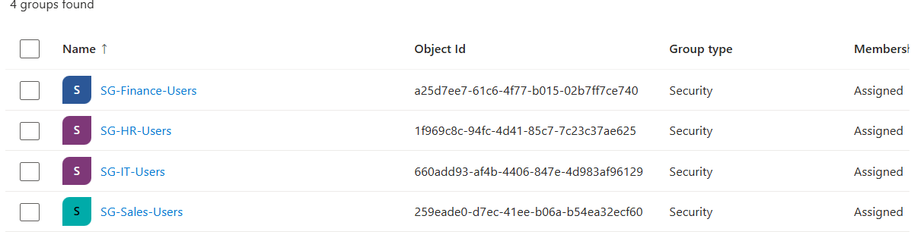
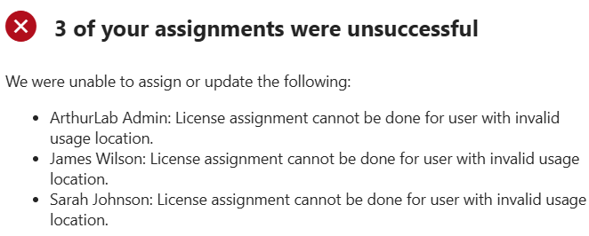
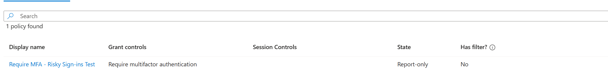
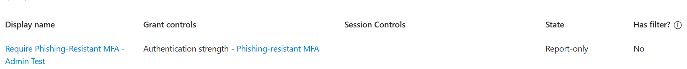
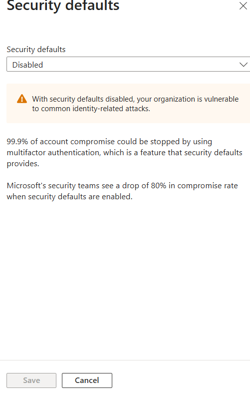

# Microsoft Entra ID Conditional Access & MFA

**Microsoft Entra ID P2 · Conditional Access · MFA · Identity Protection · Named Locations · Authentication Strength · Zero Trust**

| | |
|---|---|
| **Portfolio Area** | Identity & Access Management (IAM) |
| **Owner** | Anthony Arthur |
| **Environment** | Personal cybersecurity homelab |
| **Documentation** | Objective, architecture, implementation, validation, troubleshooting, artifacts, lessons learned, interview explanation, resume and LinkedIn content |

---

## 1. Project Objective

Design and validate Microsoft Entra Conditional Access controls that apply stronger authentication and contextual access decisions without causing unintended lockouts. The lab emphasized safe rollout practices: Report-only deployment, sign-in log review, What If simulation, positive/negative testing, and controlled enforcement.

**Environment and technologies**

- Microsoft Entra ID P2 trial
- Conditional Access, MFA and authentication strengths
- Identity Protection sign-in risk
- Named Locations
- Sign-in logs and What If
- Test identities: James Wilson, Michael Davis, Emily Carter and ArthurLab Admin

**Security design**

- Standard-user MFA policy for James Wilson
- Restricted-country block policy for Canada, Germany and Japan as simulated restricted locations
- Risk-based MFA for medium/high-risk sign-ins using Emily Carter
- Phishing-resistant MFA authentication strength for privileged ArthurLab Admin
- Security Defaults intentionally disabled after Conditional Access was introduced

This project was completed primarily through the Microsoft Entra admin center (no PowerShell scripting required) — see [Project 4](../project4-ad-entra-hybrid-identity) for the command-line-heavy hybrid identity work.

---

## 2. P2 Licensing and Administrative Preparation

Conditional Access required Entra ID P1 or higher; risk-based controls required P2. A Microsoft Entra ID P2 30-day trial was activated and licenses were assigned to the lab identities used for testing. A native tenant administrator account, ArthurLab Admin, was retained as a backup/recovery administrative identity.

**Troubleshooting note:** Initial license assignments failed for some users because Usage location was missing or invalid. Setting Usage location to United States resolved the assignment issue. This became a documented example of diagnosing licensing prerequisites rather than repeatedly retrying the same operation.

---

## 3. Policy 1 — Require MFA for James Wilson

Created **Require MFA - James Wilson Test** targeting James Wilson and all resources. The policy was first placed in Report-only mode. A fresh sign-in was generated and the Conditional Access result was reviewed in sign-in logs. After Report-only validation showed success, the policy was enabled.

- Grant control: Require multifactor authentication
- Initial state: Report-only
- Validation: Report-only Success in sign-in logs
- Final state: On
- Final validation: successful sign-in satisfying MFA

---

## 4. Policy 2 — Restricted Countries

Created the named location **ArthurLab - Restricted Countries** containing Canada, Germany and Japan. These locations were selected only to simulate an organization-specific restriction; the countries were not treated as inherently malicious.

Created **Block Access - Restricted Countries Test** for Michael Davis. A normal U.S. sign-in produced a negative test result of Report-only: Not applied. A What If simulation using Canada produced a positive policy match and showed the block control would apply.

---

## 5. Policy 3 — Risk-Based MFA

Created **Require MFA - Risky Sign-ins Test** for Emily Carter. The policy targeted medium and high sign-in risk and required MFA. It remained in Report-only mode to avoid disruptive enforcement while still proving policy evaluation.

A What If simulation using Emily Carter, Exchange Online, Windows, Browser and High sign-in risk showed that the policy would apply and require MFA. This demonstrated the difference between a static MFA rule and a contextual control based on risk.

---

## 6. Policy 4 — Phishing-Resistant MFA for Privileged Admin

Created **Require Phishing-Resistant MFA - Admin Test** targeting ArthurLab Admin and all resources. The grant control used the Phishing-resistant MFA authentication strength rather than simultaneously selecting standard Require MFA.

The policy remained Report-only because the administrator had not yet been provisioned with a qualifying phishing-resistant authentication method. This avoided creating an administrator lockout while still validating the intended policy using What If.

---

## 7. Final Policy Inventory and Validation

- Block Access - Restricted Countries Test — Report-only
- Require MFA - James Wilson Test — On
- Require MFA - Risky Sign-ins Test — Report-only
- Require Phishing-Resistant MFA - Admin Test — Report-only

**Validation approach**

- Report-only mode before enforcement
- Sign-in logs for observed behavior
- What If for controlled positive tests
- Positive and negative test cases
- Lockout avoidance for privileged accounts

---

## 8. Lessons Learned and Security Concepts

- Conditional Access should be tested before broad enforcement.
- Authentication strength can require stronger methods than standard MFA.
- Named Locations provide context but should be based on organizational policy, not assumptions about countries.
- Sign-in risk evaluates the likelihood that an authentication attempt is suspicious; user risk evaluates likelihood that an identity is compromised.
- Privileged identities warrant stronger authentication and careful rollout to avoid administrative lockout.
- Security Defaults and Conditional Access should not be treated as independent overlapping baselines without understanding their interaction.
